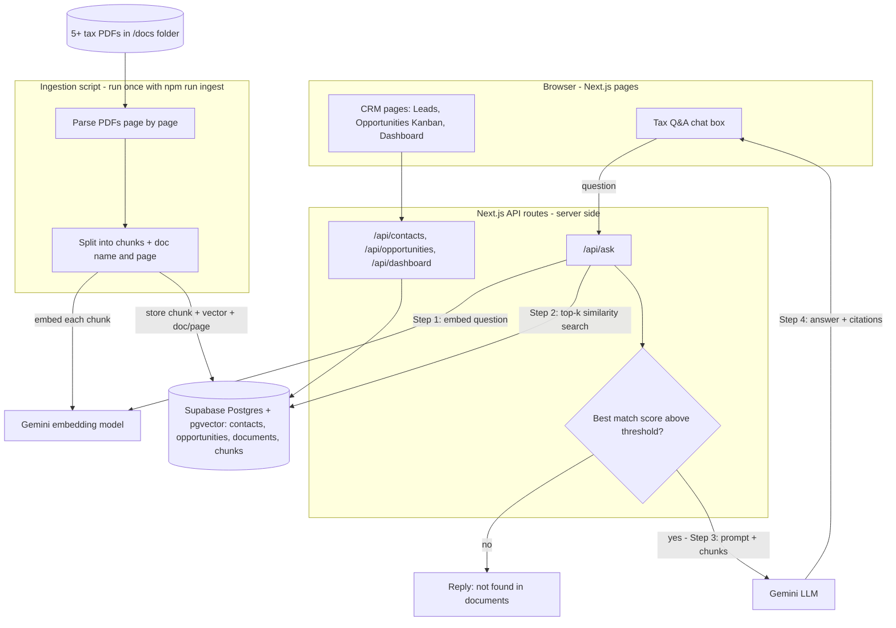

## System Design

```mermaid
flowchart TB
  subgraph Browser["Browser - Next.js pages"]
    CRM["CRM pages: Leads, Opportunities Kanban, Dashboard"]
    Chat["Tax Q&A chat box"]
  end

  subgraph Server["Next.js API routes - server side"]
    CRMAPI["/api/contacts, /api/opportunities, /api/dashboard"]
    AskAPI["/api/ask"]
    Guard{"Best match score above threshold?"}
  end

  subgraph Ingest["Ingestion script - run once with npm run ingest"]
    Parse["Parse PDFs page by page"]
    Chunk["Split into chunks + doc name and page"]
  end

  PDFs[("5+ tax PDFs in /docs folder")]
  DB[("Supabase Postgres + pgvector: contacts, opportunities, documents, chunks")]
  Embed["Gemini embedding model"]
  LLM["Gemini LLM"]

  CRM --> CRMAPI --> DB

  Chat -->|"question"| AskAPI
  AskAPI -->|"Step 1: embed question"| Embed
  AskAPI -->|"Step 2: top-k similarity search"| DB
  AskAPI --> Guard
  Guard -->|"no"| NotFound["Reply: not found in documents"]
  Guard -->|"yes - Step 3: prompt + chunks"| LLM
  LLM -->|"Step 4: answer + citations"| Chat

  PDFs --> Parse --> Chunk
  Chunk -->|"embed each chunk"| Embed
  Chunk -->|"store chunk + vector + doc/page"| DB
```